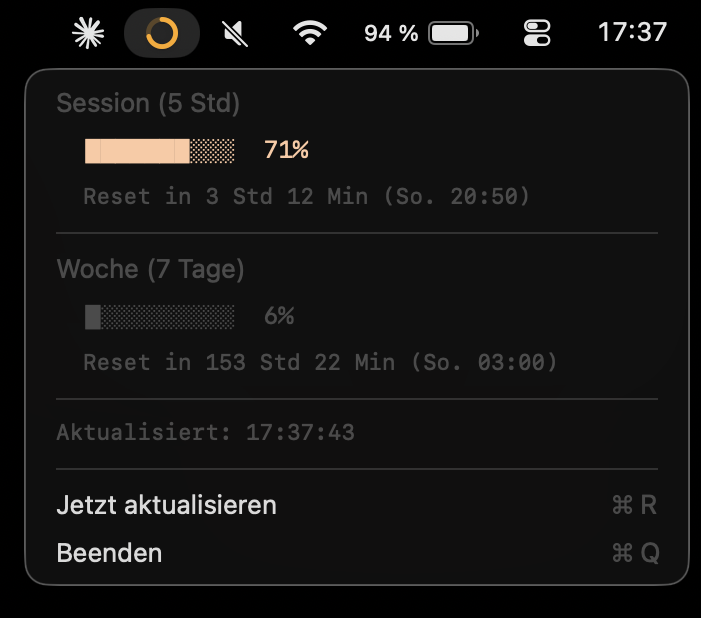

# AI Usage Bar

[](https://claude.com/claude-code)
[](LICENSE)

Eine schlanke **macOS-Menüleisten-App**, die deinen aktuellen Claude-Verbrauch als farbigen Ring in der Menüleiste anzeigt – Session- und Wochenlimit im Detail per Tooltip und Popover.



## Features

- **Session-Limit** (rollierende 5 Stunden) und **Wochenlimit** (rollierende 7 Tage) auf einen Blick
- Detail-Popover mit Balken, Prozentwerten und Reset-Zeitpunkt
- Läuft unsichtbar ohne Dock-Icon (`LSUIElement`), optionaler **Autostart beim Login**
- Native **Swift/AppKit**-App, eine einzige Quelldatei, keine Laufzeitabhängigkeiten

## Voraussetzungen

- Mac mit **Apple Silicon** (M1/M2/M3/M4), macOS 13 oder neuer
- **Claude Code** installiert und eingeloggt (die App liest den Login lokal aus – es werden keine Zugangsdaten übertragen oder gespeichert)

## Installation (fertiges DMG)

1. DMG aus den [Releases](https://github.com/tim-heyne/ai-usage-bar/releases/latest) herunterladen und per Doppelklick öffnen.
2. Im Finder Rechtsklick auf `install.sh` → *Öffnen mit* → *Terminal*.
3. Die App erscheint in der Menüleiste und startet künftig automatisch beim Login.

## Aus dem Quellcode bauen

Voraussetzung: Xcode Command Line Tools (`xcode-select --install`).

```bash
# Variante A: lokal nach /Applications installieren
./build.sh

# Variante B: verteilbares DMG erzeugen (App + install.sh + README.pdf)
./release-dmg.sh
```

Das Release-DMG wird ad-hoc signiert; eine kostenpflichtige Apple-Developer-Mitgliedschaft ist nicht nötig. Das beigelegte `install.sh` entfernt die Gatekeeper-Quarantäne und richtet den Autostart ein.

### Projektstruktur

| Datei | Zweck |
|-------|-------|
| `AIUsageBar.swift` | Die App (Single-File, Swift/AppKit) |
| `build.sh` | Baut die App direkt nach `/Applications` |
| `release-dmg.sh` | Baut das verteilbare DMG |
| `md2pdf.swift` | Wandelt das README beim Build nativ in ein PDF |
| `make_icon.swift` | Erzeugt das App-Icon |
| `dist-files/` | Endnutzer-Beilagen fürs DMG (`install.sh`, `README.md`) |

## Lizenz

MIT – siehe [`LICENSE`](LICENSE).

## Haftungsausschluss

Dies ist ein **inoffizielles Community-Tool** und steht **in keiner Verbindung zu Anthropic**. „Claude" und „Anthropic" sind Marken ihrer jeweiligen Inhaber. Die App nutzt einen inoffiziellen Endpoint, der sich jederzeit ändern oder wegfallen kann – die Nutzung erfolgt ohne Gewähr.

---

🤖 Erstellt mit [Claude Code](https://claude.com/claude-code)
